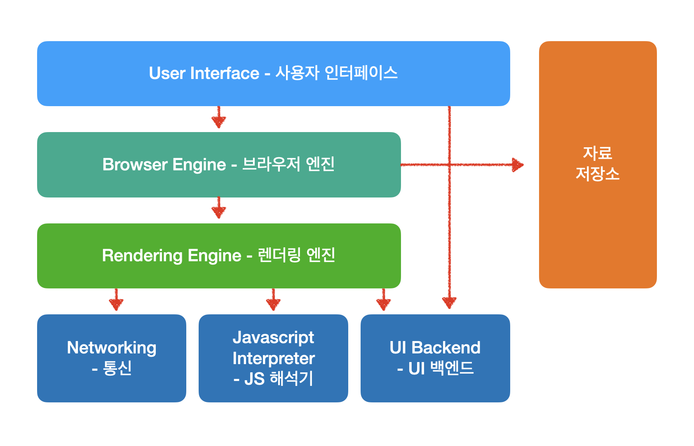

# 2022년 9월 TIL

## 2022.09.25

### 브라우저 렌더링 과정 (with Critical Rendering Path)

직관적으로는 이해하고 있으나 제대로 정리해본 적은 없는 그것.. 브라우저 렌더링 과정에 대해 알아보자. 웹 브라우저의 구조에 대해 살펴보고, 그 중에서도 웹서비스의 렌더링 퍼포먼스 향상에 큰 영향을 미치는 렌더링 엔진의 작동 방식과 CRA(Critical Rendering Path)에 대해서도 정리해보는 것으로.

먼저 웹 브라우저의 기본적인 구조를 정리해보면 다음과 같다.



1. **사용자 인터페이스**
   - 주소창, 새로고침/이전/다음 버튼 등 웹페이지 이외에 사용자가 접근할 수 있는 인터페이스 영역.
2. **브라우저 엔진**
   - 사용자 인터페이스와 렌더링 엔진 사이의 동작을 제어한다. 두 가지를 연결해주는 브릿지 역할.
3. **렌더링 엔진**
   - 브라우저의 핵심.
   - HTML과 CSS를 파싱(Parsing)해서 웹 페이지에 그려주는 엔진이다.
4. **네트워크 (통신)**
   - HTTP와 같은 각종 네트워크 요청에 사용된다.
5. **JS 해석기 (인터프리터)**
   - 자바스크립트를 해석하고 실행하는 엔진. 많이 언급되는 V8엔진이 바로 이 JS 해석기에 해당한다.
6. **UI 백엔드**
   - 기본 input, select 등 브라우저의 기본 위젯을 그려준다.
   - 사용자 인터페이스와 상호 작용한다.
7. **자료 저장소**
   - localStorage, sessionStorage, cookie처럼 브라우저에 데이터를 임시 저장할 수 있는 저장공간 영역.

이 때, 렌더링 엔진은 크게 다음과 같은 단계를 거쳐 화면을 그린다.  
::: tip CRA 과정 요약  
`DOM Tree & CSSOM Tree 파싱` > `렌더 트리 생성` > `Layout` > `Paint`  
:::

1. `파싱` - HTML을 파싱하여 DOM Tree를 그린다. (HTML의 DOM Tree가 맞음)
2. `파싱` - CSS와 스타일 요소를 파싱하여 CSSOM Tree를 그린다.
3. `렌더 트리 생성` - 만들어진 DOM Tree와 CSSOM Tree를 합쳐 렌더 트리를 만든다.
4. `Layout(Reflow)` - 요소의 위치와 크기 등을 계산하여 브라우저에 배치한다.
5. `Paint(Repaint)` - 배치된 픽셀 정보를 이용하여 실제 화면에 요소를 그린다.

위와 같은 과정을 Critical Rendering Path라고 부르며, 레이아웃과 페인트 단계를 얼마나 효율적으로 생략하느냐에 따라 웹서비스의 렌더링 효율이 달라지게 된다. (특히 애니메이션을 구현할 때 영향을 많이 미친다.)

CSS 속성별로 수정시 Layout 이후의 과정을 모두 거쳐야하는 속성, Paint 이후의 과정만 거치는 속성, Layout과 Paint를 거칠 필요 없이 Composite만 수행해도 되는 속성이 정해져있다.  
tranform이 Composite만 발생하는 대표적인 속성인데, 그래서 애니메이션을 많이 넣어야 하는 웹페이지의 경우 transform을 우선적으로 사용하는 듯. (그렇게 배워서 그렇게 쓰고는 있었지만 이유는 CRA 공부하며 처음 알았다.)

### TIL 블로그 github action 자동배포 성공

[지난번에 실패했던](/2022/2022-08.html#_2022-08-20) github action을 이용한 자동 배포에 성공했다.  
어이없게도 github action 설정 yml 파일에 오타가 있어서 안되는 거였음.. 😂  
이제는 main 브랜치에 소스코드를 push하면 자동으로 페이지 배포가 된다.  
deploy 명령어는 혹시 또 쓸 일이 있을지 모르니 살려두었다.

## 2022.09.14

### nodejs 연습

코드캠프 백엔드 수업 커리큘럼을 참고하여 nodejs를 이용해서 간단한 함수나 템플릿 만드는 방법을 연습 중.  
실행하는 부분이 브라우저에서 nodejs로 바뀌었을 뿐인데도 굉장히 신기하다. javascript가 작동하는 원리는 동일한데도!

- **오늘의 기억할 점**  
  vercel 등으로 개발 환경을 세팅하지 않고 순수 node만으로 module 타입의 ES6 자바스크립트를 실행할 경우, import해오는 js파일에도 반드시 확장자명을 붙여줘야 한다. 그렇지 않을 경우 에러를 뱉음.

  ```js
  import {
    checkValidationEmail,
    getWelcomeTemplate,
    sendWelcomeTemplateToEmail,
  } from "./email";
  ```

  이런 식으로 쓰면

  

  이렇게 에러를 뱉는다.  
  귀찮아도 꼭 `.js` 붙여줘야 함..😇

  ```js
  import {
    checkValidationEmail,
    getWelcomeTemplate,
    sendWelcomeTemplateToEmail,
  } from "./email.js";
  ```

- **백엔드 공부를 갑작스레 시작한 이유**  
  간단한 api는 스스로 개발해서 개인 프로젝트 배포까지 진행하고 싶기 때문.  
  Next.js에서 제공하는 api 기능을 이용해도 좋지만, 기왕 공부하는 거 학습을 위해서라도 백엔드에 대해 좀 더 알아보고 싶었다. 새로운 언어를 배운다면 시간이 오래 걸리겠지만 javascript는 원래 사용하고 있던 언어이기도 하고.  
  간단한 프로덕트는 나 혼자서 처음부터 끝까지 개발할 수 있는 개발자가 되고 싶다. 💪

## 2022.09.12

### Typescript - 타입 가드

::: tip ref  
원티트 프리온보딩 챌린지 9월 - Typescript의 강의 내용을 일부 요약 정리 해놓은 것  
:::

1. 타입 가드란?  
   타입스크립트가 런타임 환경에서의 모든 오류를 방지해 주는 것은 아니다.  
   런타임 환경에서 실행했을때에만 확인할 수 있는 요소 정보의 경우 (dom 조작 등) type guard를 통해 미연에 방지하는 것이 좋다.

- 타입 가드의 예시

  ```ts
  const $modalClose = document.querySelector(".modalCloseButton");

  // 3. 최소한의 타입 가드
  if ($modalClose) {
    $modalClose?.addEventListener("click", () => "aaa");
  }
  ```

2. 타입 좁히기란? (Type narrowing)  
   예시를 살펴보자.
   ```ts
   const $app: HTMLElement = document.createElement("div"); // 타입추론의 효과가 거의 없는 타입
   const func: Function = function () {
     return "string";
   };
   ```
   위와 같은 스크립트의 경우 실질적으로 any script나 다를바 없다.
   연습을 통해 타입 추론을 예측하고 타입을 좁혀나가는 연습을 해야 한다.
   ```ts
   const $app: HTMLElement = document.createElement("div");
   const $app: HTMLDivElement = document.createElement("div");
   ```
3. 컴파일 vs 런타임  
   prop-types vs typescript → 무슨 차이가 있을까?  
   바로 런타임시 타입 체크 vs 컴파일시 타입 체크의 차이.  
   typescript는 컴파일시 js로 변경되기 때문에 런타임시 발생할 수 있는 타입으로 인한 오류는 checking 하지 못하는 문제가 있다.

   그렇다면 이러한 문제를 방지하기 위해서는 반드시 props-types 등의 추가 도구를 사용해야 하는가?  
   **‼️‼️‼️ 아니다!**  
   타입 가드를 잘 사용하면 런타임시 발생할 수 있는 타입 에러도 상당부분 방지할 수 있다.

   unknown을 활용한 예시를 통해 확인해보자.

   ```ts
   let num: unknown = 99;

   // 타입가드 예시 1
   // if (typeof num === 'string') {
   num.trim();
   // }

   // 타입가드 예시 2
   // (num as string).trim();

   // 스크립트 내부에 인라인 타입가드를 넣는 것도 가능 (typdof, instanceof 등 사용)
   // function func(x: unknown) {
   //   let val1: any = x;
   //   let val2: unknown = x;
   //   let val3: string = x;
   //   let val4: boolean = x;
   //   let val5: number = x;
   //   let val6: string[] = x;
   //   let val7: {} = x;
   // }
   ```

   unknown은 any와 비슷하게 사용할 수 있지만 에러를 던진다.  
    즉, 타입 가드를 유도한다.

## 2022.09.11

### Netflix-reviews 프로젝트

댓글 CRD를 완료하고 리뷰 본문과 댓글 Update 작업을 시작했다.  
그런데 본문 Update 코드를 추가하려고 보니 ReviewsWrite 페이지 스크립트가 많이 길어졌길래 가능한 코드들을 custom-hooks로 분리해서 리팩토링 하는 작업을 우선 시작했다.

```ts
const onChangeFile = async (file: ChangeEvent<HTMLInputElement>) => {
  changeFile({ file, setImages, images });
};

const handleFileBtn = () => {
  if (inputRef.current) {
    inputRef.current.click();
  }
};

const onSubmitWrite = (data: FieldValues) => {
  reviewsSubmit(data, images);
};

const onSubmitEdit = (data: FieldValues) => {
  const originImages = data.fetchBoard?.images || [""];
  reviewsEdit(data, images, originImages);
};
```

깔끔~  
작성 / 수정 / 이미지 업로드처럼 볼륨이 큰 스크립트들을 custom-hooks로 분리했고, 동일한 쿼리와 기능을 요청하는 경우에는 해당 커스텀훅을 가져다 쓸 수 있도록 인자 설정도 해두었다.

앞으로 할 일

- react-hook-form의 yupResolver schema가 수정/작성 페이지 여부에 따라 다르게 적용되도록 하기.
- 게시글 수정 후 상세페이지로 돌아왔을 때 ApolloCacheState가 변경되도록 하기
  - fetchPolicy를 변경할까 cache를 직접 수정할까 고민했는데, cache를 직접 수정하는 쪽이 더 효율적일 것이라고 판단했다.
