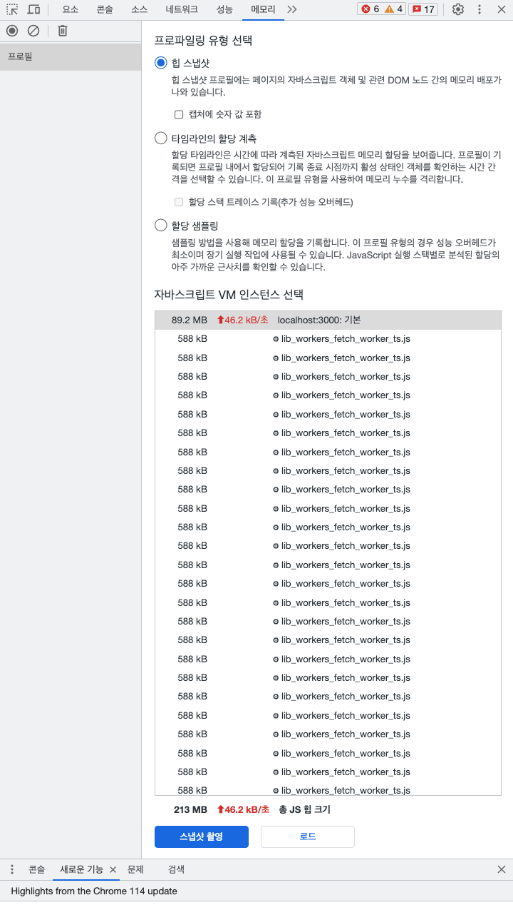

# 2023 6월 TIL

## 2023.06.19

### Web Worker로 인한 메모리 누수
여러분은 모던 브라우저의 메모리가 터지는 것을 본 적이 있으신가요?   
웹 워커를 잘못 사용하면 그럴 수 있으니 조심하라..   
동기적 실행을 위해 워커 스레드를 돌렸다면 반드시 꺼줄 것..   
- [도움받은 감사한 글 1](https://medium.com/hcleedev/web-web-worker-%EC%82%AC%EC%9A%A9%EB%B2%95%EA%B3%BC-%EC%A3%BC%EC%9D%98%ED%95%A0-%EC%A0%90-webpack-%EB%A9%94%EB%AA%A8%EB%A6%AC-%EB%AC%B8%EC%A0%9C-%ED%85%8C%EC%8A%A4%ED%8A%B8-%EB%AA%A8%ED%82%B9-2d77c5b23afe)   
- [도움받은 감사한 글 2](https://stackoverflow.com/questions/30500883/javascript-web-worker-close-vs-terminate)
- **Horrible한 장면**



## 2023.06.18
### Storybook test runner
:::tip Ref
스토리북 test runner docs : [바로가기](https://storybook.js.org/docs/react/writing-tests/test-runner)
:::

- Storybook test runner는 당신이 작성한 모든 스토리를 실행 가능한(executable) 테스트로 전환한다. Jest와 Playwright가 제공됨.
  - play function이 없는 스토리는? -> 해당 스토리가 에러 없이 렌더되는지 검증한다.
  - play function이 있는 스토리는? -> play function을 통과하는지, 그리고 모든 assertion이 패스되는지 확인한다.

### Storybook interaction test
:::tip Ref
스토리북 Play function docs : [바로가기](https://storybook.js.org/docs/react/writing-stories/play-function)
:::
[@storybook/addon-interactions](https://storybook.js.org/addons/@storybook/addon-interactions)를 이용하여 사용 가능.   
docs를 보면 알겠지만, 다음과 같은 addon에 의존성이 있다. 전부 install 필요
```sh
yarn add -D @storybook/addon-interactions @storybook/jest @storybook/testing-library
```   
그리고 `.storybook/main.js`에 addon 설정도 해준다.
```ts
export default {
  addons: ['@storybook/addon-interactions'],
};
```
이 때 주의할 점, `@storybook/addon-interactions`는 `@storybook/addon-actions`나 `@storybook/addon-essentials` 보다 반드시 나중에 위치해야 한다. 나는 둘 다 사용하고 있지 않아서 패스..


## 2023.06.15
### Chromatic
Storybook 배포를 Chromatic으로 하면 컴포넌트 스토리 변경 후 배포시마다 review 과정을 거칠 수 있다.   
배포도 간편하고 UI 관련 로직 변경에 대한 accept/reject 과정도 기록으로 남길 수 있어서 짱 좋은 듯   
개인적으로 만들고 있는 generator 웹앱에 chromatic을 달았다. github action을 이용한 ci도 붙여보자.   
- Chromatic CI Docs : [문서 바로가기](https://www.chromatic.com/docs/ci)

### 회사에서는..
- 신사업 프로젝트 진행 중
- 2주 단위 스프린트 3회 이내에 상용 서비스 가능한 MVP를 뽑아내야한다
- 목표는 빠른 개발.. 하지만 최대한 깔끔한 코드를 지향.. (이게 되나)
- 아무튼 최선을 다해보는것으로
- 에디터 클라이언트 담당자로서, 혼자 힘으로 a-z 개발하는 첫 프로젝트다.
- 끝내고 프로젝트 리뷰 뿐 아니라 개인 리뷰도 진행 할 것

## 2023.06.11
### Storybook v7.0

2년만에 스토리북 메이저 버전 업데이트가 있었다.   
야금야금 사용만 하다가 시간이 나서 릴리즈 노트 훑어봄.

::: tip 관련 공식 문서   
[릴리즈 노트](https://storybook.js.org/releases/7.0)   
[공식 Community Article](https://storybook.js.org/blog/storybook-7-0/)
:::   

### Storybook v7 릴리즈 노트 빠르게 훑어보기

- Storybook 7.0 - March 2023   
- The future of UI development   
- SB7.0 is a full rework of Storybook's core with fast build and next-generation interaction testing.
> 7.0 버전에서 스토리북의 코어를 재작업했다. 차세대 interaction 테스트와 빠른 빌드를 위하여..
   
- 3️⃣ [Component Story Format v3](https://storybook.js.org/blog/storybook-csf3-is-here/) trims boilerplate code and improves ergonomics
> CSF - 즉 컴포넌트 스토리 작성 포맷 자체가 v3으로 업그레이드되었다. 체감상 컴포넌트 스토리 작성하기가 훨씬 편해졌고 보일러 플레이트 코드도 심플해졌다. ergonomics을 향상시켰다고 하는데 말 그대로. csf3는 사용자 친화적으로 발전된 형태의 문법. 
- 🛡️ [Improved type safety](https://storybook.js.org/blog/improved-type-safety-in-storybook-7/)
> 타입 안전성 향상
- 📚 [Docs overhaul](https://storybook.js.org/blog/storybook-7-docs/) with MDX2 support and streamlined doc blocks
> Docs 재정비. MDX2 지원을 포함하여 docs 작성이 훨씬 편리해졌다.   
> 상세한 내용은 링크 참고. 개인적으로 autodocs 옵션이 너무 편리하고 좋음
- 🏗️ [Frameworks API](https://storybook.js.org/blog/framework-api/) for streamlined integrations
  - 🔼 [Zero-config NextJS](https://storybook.js.org/blog/integrate-nextjs-and-storybook-automatically/)
  - 🇸 [Zero-config SvelteKit](https://storybook.js.org/blog/storybook-for-sveltekit/)
> integration을 더 원활하게 지원. Frameworks API의 전반적인 개선.
- ⚡️ [First-class Vite support](https://storybook.js.org/blog/first-class-vite-support-in-storybook/): Storybook is configured automatically based on your Vite settings, and reduced installation size & startup time.
> storyook v6까지는 기본 번들러가 webpack4였다. vite 지원 자체는 예전부터 되었으나 여러모로 어려움이 많고 설정하기 번거로웠던 것도 사실.. v7는 기본 제공하는 두가지 번들러 옵션 중 하나로 vite를 채택할 수 있다. (vite 혹은 webpack5) 여러모로 스토리북을 vite 생태계에 원활하게 통합시킬 수 있도록 rework 하였음.   
> 이 부분도 재밌다. 가급적이면 링크걸린 원문 블로그를 정독하는 것을 추천.
- [Improved interaction testing](https://storybook.js.org/blog/test-component-interactions-with-storybook/): stabilized test runner and interactions debugger
> interaction 테스팅 향상 (대환영! 너무 좋다!)   
> 테스트 러너와 인터렉션 디버거를 안정화시켰다.
- ☂️ [Code coverage](https://storybook.js.org/blog/code-coverage-with-the-storybook-test-runner/) for interaction tests
> interaction 테스트에 대한 코드 커버리지도 확인 가능 (갓토리북)
- 🎨 [UI design refresh](https://storybook.js.org/blog/7-0-design-alpha/): edge-to-edge layout, redrawn icons & refined forms
> storybook 자체의 UI도 개선되었습니다👍
- 🏛️ [Improved stability](https://storybook.js.org/blog/storybook-ecosystem-ci/) with Ecosystem CI
> Ecosystem CI란?: 디펜던시 업그레이드로 인한 버그를 미연에 방지할 수 있도록 생태계 단위에서 사전에 경고하는 CI.. 인 것 같다. 전반적인 안정성이 향상되었음. (패키지와 디펜던시 관련 이슈에 대하여)
- 💯 Hundreds more improvements at every level
> 그 외에도 제품 전반을 통틀어 수백가지 개선점이 있습니다. 좋네요. 흥미진진.

## 2023.06.05

- 6월 원티드 프리온보딩 프론트엔드 챌린지를 신청했다.
- 본래 이직이나 취업에 목표를 두고 있는 챌린지이지만.. 이번 내 목표는 그건 아니고, 역량 향상이다.
- `컴포넌트란 무엇인가?` 그리고 `컴포넌트 주도 개발`이라는 토픽 자체가 흥미롭다. (+ storybook)

### 그래서, 컴포넌트란 무엇인가?
- 컴포넌트가 무엇인지를 먼저 정의하고 들어가야 한다.
    - Component 일 수도
    - Web Component 일 수도
    - React Component 일 수도..

### CDD란?
- Component Driven Development
- 컴포넌트 주도 개발
- 프론트엔드 개발 시 컴포넌트를 기준으로 사고한다

### 상향식 컴포넌트 개발 vs 하향식 컴포넌트 개발
- 상향식
    - 가장 작은 단위의 하위 컴포넌트를 먼저 개발
    - 이런 작은 컴포넌트를 조합하여 전체적인 컴포넌트를 완성
    - 하위 컴포넌트를 만들 때에는, 일반 사용자 뿐 아니라 개발자의 사용성도 고려해야 한다.
    - **숙련도가 부족하면 YAGNI에 빠지기 쉽다.**

- 하향식
    - 전체 시스템의 큰 구성요소를 먼저 개발
    - 중복되는 작은 컴포넌트나 공통 영역을 분리
    - 전체 시스템의 디자인과 구조를 먼저 구성하고, 이를 바탕으로 세부적인 요소들을 개발
    - **나중에 하자고 하지만 하지 않는다. (르블랑의 법칙 / Leblance's Law)**
        - **한 번 작성한 쓰레기 코드를 나중에 수정하는 일은 결코 없다..**

### 비제어 컴포넌트 vs 제어 컴포넌트
- 제어
    - 단일 진실 원천
    - 늘 입력된 값과 상태가 동일하다.
    - push component
- 비제어
    - 필요한 시점에 입력된 값을 트리거하여 가져온다.
    - pull component
- 좋은 예시 아티클 : [Link](https://goshacmd.com/controlled-vs-uncontrolled-inputs-react/)