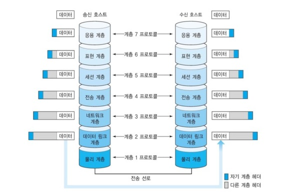
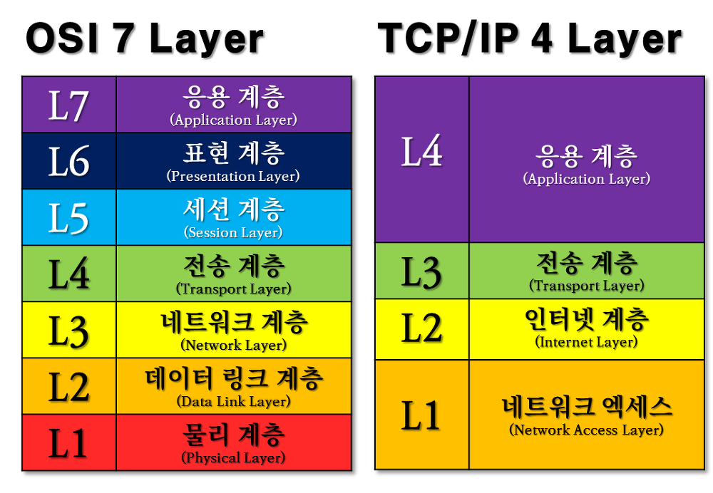

# 모두의 네트워크

:::tip ref  
**모두의 네트워크 (미즈구치 카츠야 저 / 이승룡)**  
상기 서적을 읽은 뒤 기억해두고 싶은 내용들을 모아 메모한 것입니다.
:::

## 네트워크 첫걸음

- **네트워크, 그 중에서도 컴퓨터 네트워크란?**

  - 두 대 이상의 컴퓨터를 연결하여 컴퓨터 간에 필요한 데이터를 주고받을 수 있도록 한 것
  - 두 대만 있어도 네트워크라고 할 수 있다.

- **인터넷이란?**

  - 전 세계의 수많은 큰 네트워크, 작은 네트워크를 연결하는 거대한 네트워크다
  - 전 세계 컴퓨터들을 하나로 연결하는 거대한 컴퓨터 통신망

- **패킷이란?**

  - 네트워크 통신 시 전송되는 데이터의 작은 조각. 큰 데이터가 있어도 패킷으로 잘게 나누어 보내는 것이 규칙이다.
  - 잘게 쪼개어 보내는 이유: 데이터를 통으로 보내면 해당 데이터가 네트워크의 대역폭을 과도하게 점유해서 다른 패킷의 흐름을 막을 수 있다. 즉 통신 장애 발생할 수 있음.
  - 각각의 패킷에는 일종의 번호가 부여되어 있어서 도착하는 순서가 제각각이어도 원래대로 복구가 가능하다.

- **대역폭이란?**

  - 네트워크에서 이용 가능한 최대 전송 속도로 정보를 전송할 수 있는 단위 시간당 전송량

- **비트와 바이트**

  - 모든 데이터는 0와 1의 모음으로 이루어져 있다.
  - 비트: 0과 1의 정보를 나타내는 최소 단위.
  - 바이트: 8비트. 즉, 0 혹은 1인 숫자 8개의 모음. 컴퓨터가 데이터를 다루는 가장 기본이 되는 단위.

- **문자 코드**

  - 문자와 숫자를 대응시켜놓은 코드. 특정 숫자를 입력하면 해당 숫자를 문자로 인식할 수 있게 해준다. 이러한 규칙들이 있어서 패킷을 통해 숫자 뿐 아니라 문자도 전송할 수 있는 것.
  - 아스키(ASCII) 코드도 문자 코드의 일종

- **랜 LAN vs 왠 WAN**

  - 랜 (LAN / Local Area Network)
    - 같은 건물이나 특정 지역을 범위로 하는 좁은 범위의 네트워크.
    - 물리적으로 가깝기 때문에 속도가 빠르고 오류가 발생할 확률도 낮다.
  - 왠 (WAN / Wide Area Network)
    - 인터넷 서비스 제공자(ISP / Internet Service Provider)의 서비스를 사용하여 먼 거리에 있는 컴퓨터를 연결해놓은 네트워크.
    - KT, SKT, U+등의 통신사가 인터넷 서비스 제공자의 예시다
    - 상대적으로 속도가 느리고 오류가 발생할 확률도 높다.

- **인터넷 공유기 (Broadband Router)**

  - 일종의 가정용 라우터, 가정이나 소규모 기업에서 인터넷에 접속할 때 쓰인다.
  - 요즘에는 허브, 스위칭 허브, 방화벽과 같은 다양한 기능도 함께 제공함.
  - 유선랜과 무선랜 연결 방식을 혼합하여 사용할 수 있다.

- **기업용 네트워크 환경**
  - 기업용 네트워크는 보통 외부망과 내부망을 구분한다.
  - 그 중 외부에 공개하기 위한 네트워크는 DMZ(DeMilitarized Zone)라고 부른다. 외부망과 내부망 사이에 위치한 일종의 중간 지대(서브넷)
  - 라우터에 내부망용 스위치와 DMZ용 스위치를 따로 연결해두는 것이 일반적인 소호 기업용 네트워크 구성 방법이다.
  - 상황에 따라 랜 배선도 복잡해지고 스위치의 개수도 늘어나고.. 가능성은 무한함..
  - 회사에서는 서버를 크게 세가지 방법으로 운영할 수 있다.
    - 물리 서버를 사내에 설치하는 방법
    - 데이터 센터에 서버를 두는 방법
    - 클라우드(cloud)에 서버를 두는 방법
    - 사내 또는 데이터 센터에 서버를 두고 운영하는 것을 `온프레미스(on-premise)`라고 부른다. 클라우드와 대조되는 개념.

## 네트워크의 기본 규칙

- **프로토콜이란?**

  - 통신을 위해 지켜야하는 규칙

- **OSI 모델**

  - ISO라는 국제표준화기구에서 만든 표준 규격으로 모든 네트워크 기술의 기본이 되는 모델
  - 데이터를 송/수신하는 각각의 컴퓨터 내부에서 이루어지는 일을 일곱 개 계층(레이어)으로 나눈다.
  - 

- **TCP/IP 모델**
  - 4계층으로 구성되어 있는 네트워크 모델.
  - 현재 수많은 프로그램들이 인터넷으로 통신하는 기반이 되는 프로토콜이다.
  - 
